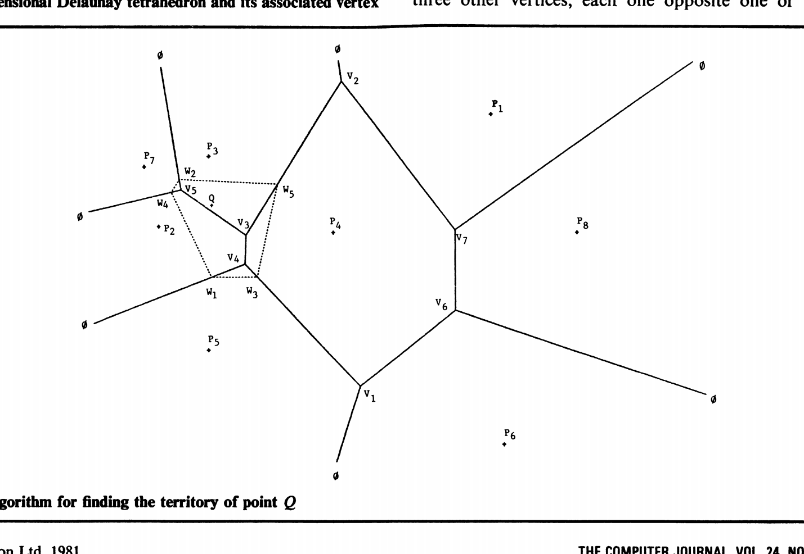

# Computing dirichlet tessellations （A. Bowyer）

## 概念

### Dirichlet tessellation（Voronoi Diagram）
Suppose the positions of $n$ distinct points $P_1 ... P_n$ in the planeare given as data. We may give each point a territory(领地) that is the area of the plane nearer to it than to any other data point. The resulting territories will form a pattern of packed convex polygons covering the whole plane. This construct is known asthe Dirichlet tessellation of the points

* In a k dimensional Euclidean space the Delaunay triangles become simplexes with k + 1 data points as vertices. 
* Each vertex in the tessellation is where k + 1 territories meet and is the centre of the hypersphere passing through all the vertices of the associated simplex. 
* As before each contiguous pair of pointsis joined by a line that is an edge of some Delaunay simplexes.
* The territorial boundary shared by the contiguous point pair is a convex polygon lying in the k - 1 dimensional hyperplane that bisects that edge.

## 数据结构定义:
In k dimensions each vertex will have k + 1 forming pointsand k + 1 neighbouring vertices opposite them.
* Two lists, each of length three
    * one list holding the forming points of the vertex(Delaunay triangles)
    * the other holding the opposite neighbouring vertex

## 算法
如果能以上述方式记录结构，然后添加新的数据点并适当修改记录，那么任何数量的点都可以通过从简单结构开始并在其基础上进行网格划分和三角测量来实现。最明显的起始模式是由前 k + 1 个点构成的德劳内单纯形。这里唯一的限制是前 k + 1 个点不能全部位于所考虑的 k 维空间的超平面上
### Adding Point
假设我们要添加的点是Q

* 1：确定当前结构中将被新点（例如 V4）删除的顶点。这样的顶点是任何一个比其形成点更靠近新点的顶点。总是至少有一个这样的顶点，因为新点所在的 Delaunay 单纯形对应的顶点总是会被删除，而且 Delaunay 单纯形完全填充了当前包含点的凸壳
* 2：从被删除的顶点开始，在顶点结构中执行树状搜索，查找其他将被删除的顶点。如果数据的存储方式如表 1 所示，则这是一个简单的问题。结果将是新点 Q 删除的所有顶点的列表： {V4, V3, V5}
* 3：与 Q 相连的点是构成被删除顶点的所有点： {P2，P5，P4，P3，P7}
* 4：如果这两个点之间的所有顶点 {V4, V3} 都在删除顶点列表中，那么这两个点之间的旧连续点就会被删除（如 P2 - P4）
* 5：在这种情况下，新点有五个与之相关的新顶点： {w1, w2, w3, w4, w5}。计算它们的形成点和相邻顶点。每个顶点的形成点将是点 Q 和与 Q 相邻的 k 个点。网格中的每条线都有 k 个点围绕着它（例如，线 V3- V2 是由 P3 和 P4 形成的）。新顶点及其邻近顶点的形成点可以通过考虑已删除顶点列表中的成员所指向的本身未被删除的顶点，并找到它们周围的点环来找到。因此，w5 从 Q 向外指向 V2，由 {P3, P4, Q) 形成
* 6：最后一步是复制一些新顶点，覆盖已删除顶点的条目，以节省空间