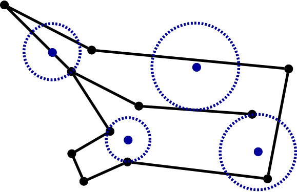
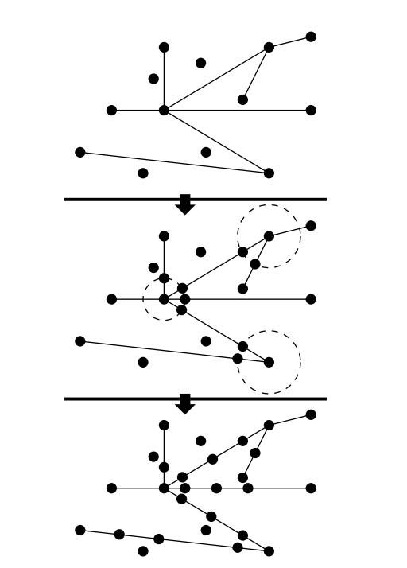

# Constrained Delaunay Tetrahedralizations and Provably Good Boundary Recovery （Shewchuk）

## Definitions
### Occluded
* visibility between two points p and q is occluded if there is a constraining facet f of X such that p and q lie on opposite sides of the plane that includes f, and the line segment pq intersects f.
* If either p or q lies in the plane that includes f, then f does not occlude the visibility between them.（如果p/q是面上的一点，那么面不会造成pq之间的遮挡）
* Segments in X do not occlude visibility（线段不会造成遮挡）

### Delaunay and strongly Delaunay
* Let s be any simplex (tetrahedron, triangle, edge, or vertex) whose vertices are in X (but s is not necessarily in X).(假设单纯形s的顶点来自于plc，但s本身不一定被plc包含)
* S is a circumsphere of s if S passes through all the vertices of s（假设大S是s的广义外界圆），If s is a tetrahedron, then s has a unique circumsphere; otherwise, s has infinitely many circumspheres.（如果s是四面体，那么外接圆是唯一的）
* <b>The simplex s is Delaunay</b>: if there is a circumsphere S of s that encloses no vertex of X (although any number of vertices is permitted on the sphere itself)(对于s，如果存在一个外接圆内部不包含X的其他顶点，那么称s是Delaunay的)
* <b>The simplex s is strongly Delaunay</b>: if there is a circumsphere S of s such that no vertex of X lies inside or on S, except the vertices of s.（对于s，如果存在一个外接圆，该外接圆内部和圆周不包含X的其他顶点，那么称s是strongly Delaunay）. Every vertex is strongly Delaunay (每个顶点都是strongly Delaunay)
* [importance!]if a vertex set has fiveor more vertices that lie on a common empty sphere, the vertex set has more than one (unconstrained) Delaunay tetrahedralization（如果一个点集拥有5个以上的点，并且每个点都位于同一个圆周上，那么这个点集有不止一种Delaunay tetrahedralization）Every Delaunay simplex appears in at least one of those tetrahedralizations, but a strongly Delaunay simplex appears in every Delaunay tetrahedralization（普通Delaunay simplex至少存在其中一种dt中，但强Delaunay simplex肯定存在每一种dt中）（解释：可以从2d情况思考。每个点都是强Delaunay simplex，它确实存在与每一种dt中，convex hull的线段也是强Delaunay simplex，它存在于在每一种dt中，非convex hull的线段是一定是普通Delaunay simplex，因为这种线段的外接圆只要挪动一点，内部一定会存在X的其它点，这种线段并不是存在于每一个dt…………）

### simplex s respects X 
* the simplex s respects X if no segment is cut in two by s, and s does not penetrate from one side of a facet to the other（如果没有线段被 s 一分为二，且 s 不从一个面的一边穿到另一边，则单纯形 s 尊重 X）（解释：因为s只是顶点来自于X，因此s如果是线段或者面，则可能穿过X的某个面或者线段；respect X保证了s的线面和X的线面不交叉）
* Formally, s respects X if s lies in the triangulation domain and the intersection of s and any segment or facet of X is a union of faces of s（从形式上看，如果 s 位于三角剖分域中，且 s 与 X 的任何线段或面的交集都是 s 的面的联合，则 s 尊重 X）

### simplex s is constrained Delaunay
* The simplex s is constrained Delaunay if
    * s respects X,
    * there is a circumsphere S of s such that no vertex of X inside S is visible from any point in the relative interior of s.

### Constrained tetrahedralization
* A tetrahedralization T is a constrained tetrahedralization of X if T and X have the same vertices (no more, no less), the tetrahedra in T respect X, and the tetrahedra in T entirely cover the triangulation domain(如果 T 和 X 的顶点相同（不多不少），T 中的四面体尊重 X，且 T 中的四面体完全覆盖三角形域，则 T 是 X 的受约束四面体化)(解释：constrained tetrahedralization只是说剖分结果和X中已经定义的面不冲突，但不一定是Delaunay的)
* (A constrained Delaunay tetrahedralization of X) is (a constrained tetrahedralization of X in which each tetrahedron is constrained Delaunay)(X 的受约束 Delaunay 四面体化是 X 的受约束四面体化，其中每个四面体都是受约束 Delaunay)（解释：CDT是在ct的基础上，要求ct的结果中每一个四面体满足cd要求）

### CDT 
* A constrained Delaunay triangulation (CDT) of X has no vertices not in X, and every segment of X is a single edge of the CDT 
* A simplex is constrained Delaunay if it has a circumcircle that encloses no vertex of X that is visible from any point in the relative interior of the simplex

### CCDT
* conforming constrained Delaunay tetrahedralization (CCDT) of X: “conforming” because additional vertices are permitted, and “constrained” because its tetrahedra (and faces and edges) are all constrained Delaunay.(解释，cdt不允许添加新顶点，不是所有plc都有cdt的。ccdt运行添加新顶点得到新的plc，新的plc必有cdt)

### Edge Protection（同另一篇论文里面的ridge-protected）
* A PLC X is edge-protected if <b>every segment</b> in X is strongly Delaunay
* the existence of a CDT. 
* Theorem 1 If X is edge-protected, then X has a CDT.(解释：这不是一个充要条件)
* Although the boundary segments of a facet must be strongly Delaunay for the guarantee to hold, no such restriction applies to the edges introduced into the facet by meshing.
    * For example, consider finding a tetrahedralization of a cube. Each square face must be partitioned by a diagonal edge to yield a triangulation. The diagonals are not strongly Delaunay, and if they were segments in the PLC, a constrained tetrahedralization might not existt (depending on the choice of diagonals). If the diagonals are not elements of the PLC, the existence of a CDT is guaranteed by Theorem 1, and a CDT construction algorithm can choose a compatible set of diagonals.

### Grazeable Segment 
* A segment is grazeable if two consecutive facets in the rotary order are separated by an interior angle of 180◦ or more (as Figure 10 shows), or if the segment is included in fewer than two facets(0 or 1). (An interior angle subtends the interior of the triangulation domain. Exterior angles of 180◦ or more are not an impediment to a CDT.) 
* Only the grazeable segments need to be strongly Delaunay to guarantee a CDT. 

###  Weakly edge-protected
* A three-dimensional PLC X is weakly edge-protected if each <b>grazeable segment</b> in X is strongly Delaunay. 
* If X is weakly edge-protected, then X has a CDT.
* Any PLC can be made edge-protected (weakly or fully) by the insertion of additional vertices that split the segments into smaller segments

### The local feature size
* the local feature size lfs(p) of any point p in space is the radius of the smallest ball centered at p that intersects two segments or vertices in X that do not intersect each other.（空间中任意点 p 的局部特征尺寸 lfs(p) 是以 p 为中心，与 X 中两个互不相交的线段或顶点相交的最小球的半径。）(解释：)

* Delaunay refinement algorithms typically bound the sizes of the elements they create in terms of this or a similar definition of lfs.
* lfs is a continuous function that is positive everywhere and suggests a rough upper bound on how large high-quality elements can be. 
* It can vary widely over the domain, reflecting the impact of domain geometry on element size. The function lfs is defined in terms of the input PLC and does not change as new vertices are inserted.
* The local feature size lfs(vi) is simply the distance from vi to the nearest vertex or segment that doesn’t intersect vi.

## Method
### Edge Protection Testing
* Form the Delaunay tetrahedralization T of the vertices using any standard algorithm
* If a segment s is missing from T, then s is not strongly Delaunay.
* If s is an edge of T, then s is Delaunay but might not be strongly Delaunay.
    * Symbolic perturbation technique: ensure that every edge (and triangle and tetrahedron) that is Delaunay is also strongly Delaunay. Then, if s is an edge of T, s is strongly Delaunay.

### The edge protection algorithm
* proceeds in two steps:
    * uses <b>protecting spheres</b> centered at input vertices to choose locations to insert new vertices.
        * Let V be the set of vertices in X where at least two segments meet at an angle less than 90◦
        * Imagine that each vertex vi in V is the center of a sphere Si with some appropriate radius ri, which may be different for each vertex. 
        * The algorithm inserts a new vertex at the point s ∩ Si
        * Insert all the new vertices generated this way into the Delaunay tetrahedralization constructed(using Bowyer–Watson)
    * The second step recovers the segments that are not ends by recursive bisection（递归平分）
        * Any segment that is not strongly Delaunay is split in two with a new vertex at its midpoint
        * When every subsegment is strongly Delaunay, the PLC is edge-protected and the algorithm terminates.

* The protecting spheres cut off the ends of some segments, Each of these “ends” is guaranteed to be strongly Delaunay because no vertex lies on or inside its diametral sphere("保护球"把某些线段的末端切掉，这些末端肯定是强Delaunay的，因为这些末端形成的直径球不包含其他顶点)
* The only segments that can pierce the diametral spheres of the ends are other ends. The second step does not insert a vertex into any of the ends, so the ends remain strongly Delaunay. （唯一能穿透两端直径球面的线段是其他端点。第二步不会在任何端点上插入顶点，因此端点仍然具有很强的德劳内性）

* <b>How are the sphere radii ri chosen?</b>
    * The radii should be as large as possible while accomplishing two goals. 
    * First, if both ends of a segment are clipped, the middle subsegment should not be too short. This goal is accomplished by choosing ri no larger than  li/3, where <b>li is the length of the shortest segment that is clipped by Si</b>.
    * Second, the diametral spheres of the ends cannot enclose any vertices, nor any subsegments that are not ends. This goal is accomplished by choosing ri no larger than lfs(vi), and no larger than 2di/3, where <b>di is the length of the shortest segment adjoining vi whose other end is clipped.</b> 
    * Note that di is sometimes less than li, because a segment whose far end is clipped and whose near end is not clipped—because only one end adjoins another segment at an angle less than 90◦—figures into di but not li.
    * ri = min{lfs(vi), li/3, 2di/3}.

* <b>Theorem 2</b>:This algorithm for edge-protecting a PLC creates no segment shorter than one-quarter the local feature size of any point in that segment.
* <b>Theorem 3</b>:Let T be the CCDT of a PLC X yielded by applying the edge-protection algorithm described above, then constructing the CDT of the augmented PLC. Let e be any edge of T, and let u be any point in e. If the endpoints of e lie in two different segments of X that meet at an angle of φ < 60◦ , then |e| ≥ lfs(u) sin(φ/2)/2. For any other edge, |e| ≥ lfs(u)/4.

### Constructing CDTs
* The first step of constructing the CDT of a PLC is to construct the two-dimensional CDTs (triangulations) of all the facets of the PLC (构建 PLC CDT 的第一步是构建 PLC 所有面的二维 CDT（三角剖分）。)
* by using a two-dimensional version of the gift-wrapping algorithm described below, or by constructing the Delaunay triangulation of the vertices of a facet, then inserting the segments one by one. (使用下面描述的二维版本的礼品包装算法，或构建面顶点的 Delaunay 三角剖分，然后逐个插入线段)
* Call each triangle of each facet CDT a constraining triangle, because these triangles are constrained to appear as faces of the tetrahedralization. (将每个面 CDT 的每个三角形称为约束三角形，因为这些三角形被约束为四面体化的面。)
* There are two known algorithms that can construct the CDT of any PLC X that has a CDT, including any weakly edgeprotected PLC—if no five vertices of X are cospherical. (If the latter condition is not satisfied, see Section 9.) These are naive gift wrapping, and a sweep algorithm.

* Gift-wrapping
    * begins by choosing one constraining triangle, which serves as a seed upon which the constrained Delaunay tetrahedra crystallize one by one. Both sides of this triangle, plus each face of every crystallized tetrahedron, is used as a base from which to search for the vertex that serves as the apex of an adjacent tetrahedron.(首先选择一个约束三角形，将其作为种子，在此基础上逐个结晶出约束德劳内四面体。这个三角形的两边，加上每个结晶四面体的每个面，都将作为一个基点，用来寻找作为相邻四面体顶点的顶点。)
    * Because the na¨ıve gift wrapping algorithm is slow, and the faster sweep algorithm takes a good deal of effort to implement and is difficult to make robust, I suggest a third CDT construction algorithm

* Incremental Facet Insertion
    * The algorithm begins with a Delaunay tetrahedralization of the vertices of a fully edge-protected PLC and incrementally recovers the missing facets one by one
    * The incremental facet insertion algorithm seems likely to strike the best trade-off between ease of implementation and speed in many practical applications. Another advantage of the algorithm is that there is no need to precompute the two-dimensional CDTs of the facets; these are produced automatically. Hence, this may be the easiest option to implement.
    * Imagine a PLC X whose CDT T has been constructed. Let f be a facet we would like to insert into the PLC (and recover in the tetrahedralization). <b>The segments that bound f must already be present in X, and they must appear as edges in T.</b>
    * The goal of a facet insertion algorithm is to convert T into T^f. 
    * To find the CDT of an edge-protected PLC Y , let X be a PLC containing all the vertices and segments of Y , but no facets. (Note that there is no need for the algorithm to actually store X; X is just a mathematical construction for our understanding.)
    * Let T be the Delaunay tetrahedralization of the vertices in X. Because Y is fully edge-protected, every segment in X is strongly Delaunay, so T is the CDT of X???
    * Next, insert the facets of Y into X, one by one. With each facet insertion, update T so it is still the CDT of X. 
    * The key observation is that because X always remains edge-protected, this update is always possible. 
    * When all the facets have been inserted, X = Y and T is the CDT of Y —or would be if T didn’t cover the entire convex hull of the triangulation domain.
    * The final step is to remove from T any tetrahedra that do not lie in the triangulation domain.

    * an algorithm for recovering a facet f
        * How does T transform into T^f? First, find all the tetrahedra in T that intersect the relative interior of f
            * It may be that f is already represented as a union of triangular faces(作为三角形面的结合), in which case there is nothing to do. 
            * Otherwise, the next step is to delete from T each tetrahedron whose interior intersects f, as Figure 13 illustrates.
        * Next, use the na¨ıve gift-wrapping algorithm to retriangulate the polygonal cavities created on each side of f. Be forewarned that there may be more than one polygonal cavity on each side of f, because some triangular faces of the tetrahedralization might already conform to f before f is inserted.
        * To retriangulate a cavity, let Z be a PLC consisting only of the triangular faces that bound one cavity, plus their edges and vertices. Happily, the na¨ıve gift-wrapping algorithm works correctly even if some or all of the facets on the convex hull of the region being triangulated are left unspecified. So when a polygonal cavity is triangulated, f may be omitted from the description of the cavity. Therefore, there is no need to precompute the two-dimensional CDT of f before inserting it.？？ When the cavity is tetrahedralized, the two-dimensional CDT of f appears automatically on the surface of the cavity tetrahedralization.

## Vertex Insertion and Deletion
* Once a domain has been tetrahedralized with constrained Delaunay elements (collectively forming a CCDT of the input PLC), some of these elements will be of poor quality and need to be improved

## Degeneracies and Robustness
* Symbolic perturbation ensures that the gift-wrapping and sweep algorithms correctly produce a CDT of any weakly-edge protected PLC, and simplifies the test for strongly Delaunay segments