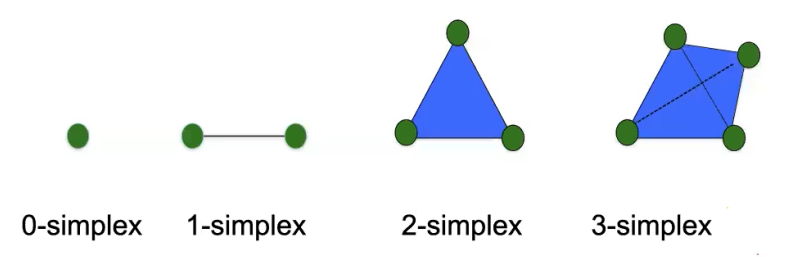

# Incremental topological flipping works for regular triangulations

## 概念
* 单纯形（Simplex）：在数学和几何学中，一个 k-单纯形是由 k + 1个仿射独立的点构成的几何形状。当k = 0时，一个0-单纯形就是一个点; 当k = 1时，一个1-单纯形就是一个线；以此类推。 单纯形都是凸的，并且他的每个面（边、面、体）也是凸的。

* 单纯形细胞复形（Simplicial Cell Complex）: 一个单纯形细胞复形是由一组单纯形组成的集合，满足一些特定条件。这组单纯形需要满足以下两个条件
    * 如果一个单纯形属于该集合，那么它的所有边、面、体等子单纯形也必须属于该集合。这确保了包含在复形中的每个单纯形的所有子单纯形也在复形中
    * 如果两个单纯形都属于该集合，那么它们的交（共同的边、面、体等）也必须属于该集合。这确保了复形中包含的单纯形之间的重叠部分也在复形中

* 正交中心（orthogonal center）: 如果一个带权点$z$对于
* 全局正则：如果对于所有属于 $S$ 中但不属于集合 $T$ 的点 $q$，都有 $\pi_z(q) > \omega_q$，则称 A 是全局正则的。这表示点集 $T$ 对于所有的点 $q$，都对应着点 $z$ 与 $q$ 之间的平方距离大于 $q$ 的权重

## 符号定义:
* $T$ 表示 k+1个仿射独立点的集合

* $\bigtriangleup_T$表示k-单纯形, 由点集$T$计算凸包得到， 即$\bigtriangleup_T = conv(T)$

* $C$表示单纯形细胞复形

* $S$表示有限的带权重的点集，其中每个点$\mathbf{p} = (p_1, p_2, \ldots, p_d) \in \mathbb{R}^d$, 权重为$\omega_p$ (每个点一个权重)

* $p^{+}=\left(p_{1}, p_{2}, \ldots, p_{d}, p_{d+1}\right) \in \Re^{d+1}$表示对点$\mathbf{p}$做提升操作，其中$p_{d+1}=\sum_{i=1}^{d} p_{i}^{2}-w_{p}$ （这个地方应该是先求和再减$w_{p}$）

* $S^+$表示对有限的带权重的点集$S$中的每一个点做提升操作得到的新集合

* $\left | xp \right |$表示点$x$到点$p$的Euclidean距离, 写作$\left | xp \right |=\sqrt{ {\textstyle \sum_{d}^{i=1}(x_i - p_i)^2} } $

* $\pi _p(x) = \left | xp \right | ^2 -\omega _p$ 表示从点$x$到点$p$平方距离（power distance of x from p）
  
* 带权点的正交性：如果两个带权点满足 $\left | pz \right | = \omega _p + \omega _z$则称两点正交（orthogonal），这等价于$\pi _p(z) =  \omega _z $和$\pi _z(p) =  \omega _p $

* $P(S)$ 表示Power Diagram of $S$

* $R(S)$ 表示Regular Triangulation of $S$, 由正则d-单纯形组成。$P(S)$和$R(S)$是对偶图